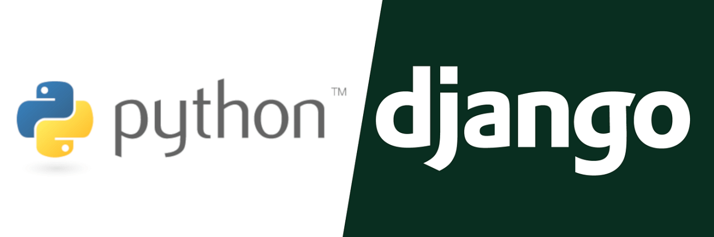

<h1 align="center">Expert lab - Prototype 1</h1>

## 📜 Description
Simple backend application made with Pyhton and the Django framework that displays articles made by users. Users can register and login to the application. When logged in users are allowed to create, update and delete articles. The application is connected to an AWS RDS postgres database. 

## ⚙️Core features
- Login and registration system (along with a guest option)
- Full CRUD operations for articles
- AWS RDS database connection
- A overview page that displays all articles
- A detail page that displays a single article
- A 'my articles' page that displays all articles created by the logged in user
- Users can only edit and delete their own articles
- Users can only add articles when logged in

## 📦 Tech stack
- back-end:
    - Python
    - Django
- front-end:
    - HTML5
    - CSS3
- infrastructure:
    - AWS RDS
- database:
    - PostgreSQL
    

## 🔧Installation

## 🔍 Sources

- LinkedIn Learning course used for general help with syntax, structure and info on class based view  
-> https://www.linkedin.com/learning/django-essential-training/what-is-django?resume=false&u=121303466

- Django gitingnore   -> https://djangowaves.com/tips-tricks/gitignore-for-a-django-project/

- Reset.css file   -> https://codepen.io/kevinpowell/pen/QWxBgZX

- Help with resolving a security issue were only a specific IP adress could make a connection to the AWS RDS database  
-> https://chatgpt.com/share/670c24f5-6a24-8008-b8c0-ddd1be87d176

- Used for getting the correct settings to get media files to work  
->https://chatgpt.com/share/670c2b49-133c-8008-9a69-74a1c8172138

- General sources:

    - Django documentation  
    -> https://docs.djangoproject.com/en/3.2/

    - W3Schools  
    -> https://www.w3schools.com/django/